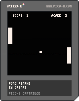
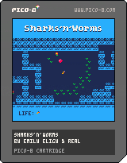

# PicoFunZone

## About

This repository contains several games made for Pico-8. Each folder contains their `.p8` source code, a `.p8.png` executable, as well as their `html` and `js` export file.

The home page leading to the links of this GitHub page is at this address: **[picofunzone.framer.website](https://picofunzone.framer.website/)**

## Controls

- Cursor keys
- 'x' key for fire
- Gamepad compatible
- Touch controls on mobile

## Games in this repository

*Click links to play*

### [Burger Biker](https://realjck.github.io/pico-fun-zone/burger-biker/)

### [Pong by OpenAI](https://realjck.github.io/pico-fun-zone/pong/)

### [Sharks'n'Worms](https://realjck.github.io/pico-fun-zone/sharks-n-worms/)
